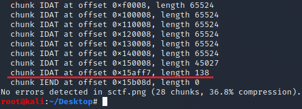

# PNG的IDAT隐写

检查PNG各个块  
```bash
pngcheck -v sctf.png 
```

IDAT块的完整大小一般是65524个字节，如果没有填满就填下一块，说明有人为添加的痕迹。  

如图1所示，最后一个IDAT块从0x15aff7开始，除了'IDAT'四个字节，后面138字节都是数据，即从789C...7667。  


Exp:
```python
import zlib
import binascii

IDAT = bytes.fromhex('789C5D91011280400802BF04FFFF5C75294B5537738A21A27D1E49CFD17DB3937A92E7E603880A6D485100901FB0410153350DE83112EA2D51C54CE2E585B15A2FC78E8872F51C6FC1881882F93D372DEF78E665B0C36C529622A0A45588138833A170A2071DDCD18219DB8C0D465D8B6989719645ED9C11C36AE3ABDAEFCFC0ACF023E77C17C7897667')

data = zlib.decompress(IDAT)      # file命令显示zlib compressed data，用zlib解压缩
# print(data)
print(len(data))    # 长度为625，即25 * 25，猜测是二维码图片


import PIL
from PIL import Image

MAX = 25
pic = PIL.Image.new('RGB', (MAX, MAX))
raw_str = data.decode()

i = 0
for y in range(0, MAX):
    for x in range(0, MAX):
        if (raw_str[i] == '1'):
            pic.putpixel([x, y], (0, 0, 0))    # 如果是1，则在[x, y]画黑色像素
        else:
            pic.putpixel([x, y], (255, 255, 255))   # 如果是0，则在[x, y]画白色像素
        i += 1

pic.show()
pic.save('flag.png')
```