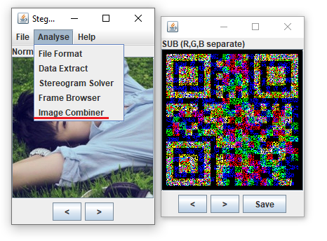
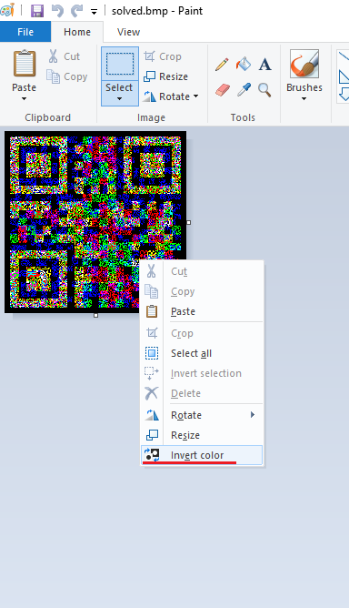

# 男神一般都很低调 - 双图比较

1. Stegsolve打开第一张图片，然后用里面的Image Combiner打开第二张，调一下，得到一张二维码图片，保存。

2. 用mspaint反色调整。

3. 用Stegsolve打开调整后的二维码图形，可以分别在  
Red plane 0得到字符串'DES'，  
Green plane 0得到字符串'6XaMMbM7'，  
Blue plane 0得到字符串'U2FsdGVkX18IBEATgMBe8NqjIqp65CxRjjMxXIIUxIjBnAODJQRkSLQ/+lHBsjpv1BwwEawMo1c='，  
解密得ctf{67a166801342415a6da8f0dbac591974}  
