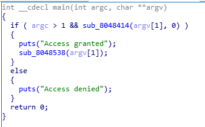
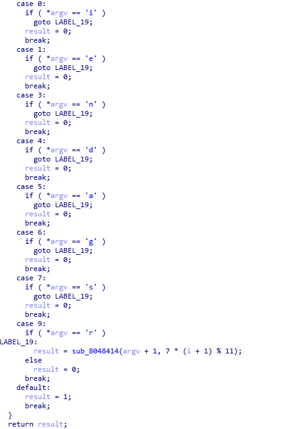

# elrond32

题目给出的条件是，当argc > 1 && sub_8048414(argv[1], 0)成立时，输出flag  



跟进sub_8048414()函数：



## 关键函数的基本逻辑

1. 当i为0,1,3,4,5,6,7,9时，且当argv等于对应的字符时，会跳转到LABEL_19，执行新的函数，参数一argv += 1，参数二变为新的i = 7 * (i + 1) % 11，否则当\*argv不等于相应字符时，return 0  

2. 当i不为以上数字时，return 1，然后层层退出。  

## 递归步骤

1. i = 0，所以应有，当\*argv == 'i'时，逻辑才能正确跳转到LABEL_19  
2. i = 7 * (i + 1) % 11 = 7，所以应有，当\*(argv + 1) == 's'时，才能正确跳转。  
3. i = 7 * (i + 1) % 11 = 1，所以应有，当\*(argv + 2) == 'e'时，才能正确跳转。
4. i = 3，应有，\*(argv + 3) == 'n'
5. i = 6，应有，\*(argv + 4) == 'g'
6. i = 5，应有，\*(argv + 5) == 'a'
7. i = 9，应有，\*(argv + 6) == 'r'
8. i = 4，应有，\*(argv + 7) == 'd'
9. i = 2，跳转到default，然后return 1，然后层层都return 1

## Exp
```bash
./rev300 isengard
```

PS：gdb带参数调试
```bash
gdb --args ./rev300 isengard
#           argv[0]  argv[1]
```